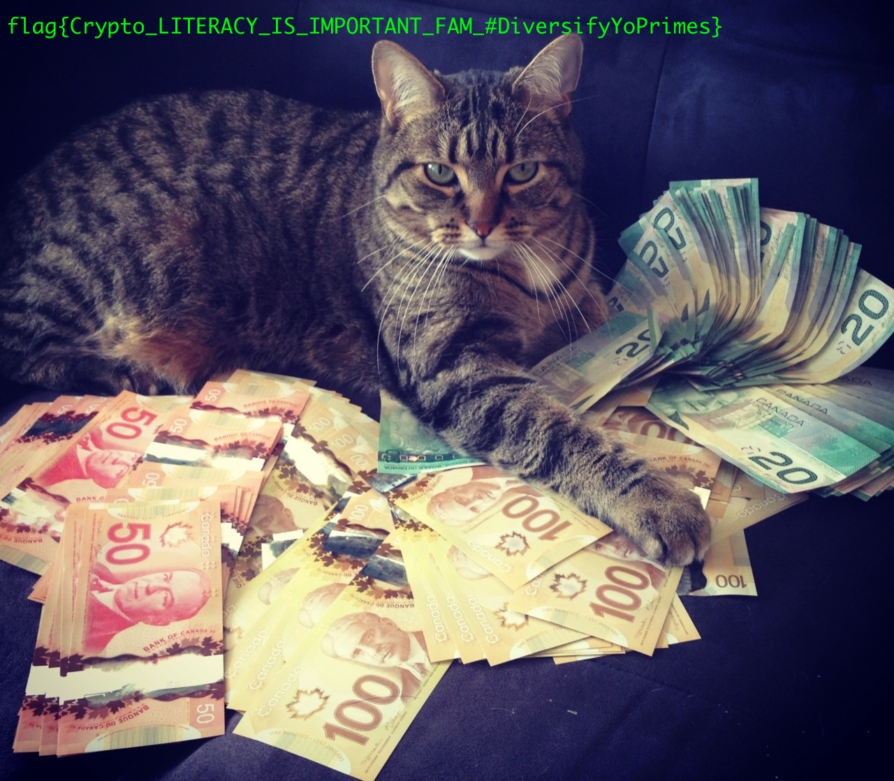

Slabs of Platinum

Crypto 500

You showed great skill with the last target! But we have found the encrypted image and remnants of an even more complex encryption scheme.
Can you help us?

-Trail of Bits (quend)

slabs_of_platinum_7f07f420a08ea404b88c4888f23c70e3
real_hackers_use.sage_2f88c5095680fd3bb890bfc088ea6852


Alright, so a .sage file is given, in addition to the encrypted file. Apparently, a .sage file is used by SageMath, an (extraordinarily extensive) open source math system.
So after downloading SageMath and setting it up, we can get to work.


The basic algorithm looks like this:

encrypted file = AES(KEY, file, IV)

With decryption looking strikingly similar

...great.

We're given:
```python
n = 20313365319875646582924758840260496108941009525871463319046021451803402705157052789599990588403L
e = 1404119484958500351776

ctxt = (master_key^e % n)
and
ctxt = 4104314974842034312729644734009867622818315323910143873563666990448837112322264379294617825939
so
(master_key^e % n) = 4104314974842034312729644734009867622818315323910143873563666990448837112322264379294617825939

IV = ctxt[78:94] ^ seed

len(KEY) = 24
len(seed) = 16
```
and seed is the first 6 bytes of the PNG header + '0000'


So if we can find master_key, we're golden

Let's try factoring n with our friendly neighborhood factordb.com
```python
p = 123722643358410276082662590855480232574295214169
q = 164184701914508585475304431352949988726937945387
```
At this point, I thought the rest of the challenge would be a cakewalk.
Oh, how wrong I was

Because e and phi ((p-1)*(q-1)) aren't coprime!

To get e to a prime factor (e was even), we divide e by 32

So now e = 43878733904953135993

Running all the new numbers through solve500.py (shoutout to 193s for the original script), we're presented with a few possibilities:
```python
8850291109671606187019051385847346626341633319270658248902240757028899879368625867493699093050
351597904423835841539846968300368167079348230618685886996023032073621044810985513589420381173
19961767415451810741384911871960127941861661295252777432049998419729781660346067276010570207230
9776384985711978954808453137332158002636678369058694126862616263798056939149371313547555838549
9619012806897961290218461321186519897105753403600107068778825886588506991961420215788513671918
10911110995115971211159510710112111595971141019511510199114101116
11111476305780204554365860486123692426515143947193278693857869774296852921996952918715985215296
19544643622649291479725348904910411727181773470330854988459324210647824451544746931106061908419
19387271443835273815135357088764773621650848504872267930375533833438274504356795833347019741788
926093876040372767789401751495722487290161020999195388670487618365128200800256956252970846615
768721697226355103199409935350084381759236055540608330586697241155578253612305858493928679984
9201889014095442028558898354136803682425865578678184625188151677506549783160099870884005373107
20313365319875646582924758840249584997945893554660303808335909340207431564137541279400876487287
10694352512977685292706297519073976211835256122271356250267195565214895713195632573811476916485
11463074210204040395905707454413149482599376206600805070143780694774502825788426922106291495353
10536980334163667628116305702928338106304331156812769192183405188005345766007681476052434749854
```
But, knowing that
```python
KEY = ptxt
if len(KEY) == 24:
    print 'all is good'

master_key = ""
m = map(ord, ptxt)
for i in m:
	master_key += str(m)
```
We know that len(master_key) = 24

So, we need to find which of these number gives master_key something resembling the correct length, which is anywhere in the range of 48-72, assuming master_key is human-readable (minimum length 2 of ord(char) and max length 3)

The only one that's even remotely close is 10911110995115971211159510710112111595971141019511510199114101116, which through a little reformatting and common sense gives us
```python
master_key = [109,111,109,95,115,97,121,115,95,107,101,121,115,95,97,114,101,95,115,101,99,114,101,116]
(mom_says_keys_are_secret)
```

Now, we can just throw our final numbers in the decrypt() function, and we get the flag (after some PNG repair):

flag{Crypto_LITERACY_IS_IMPORTANT_FAM_#DiversifyYoPrimes}
